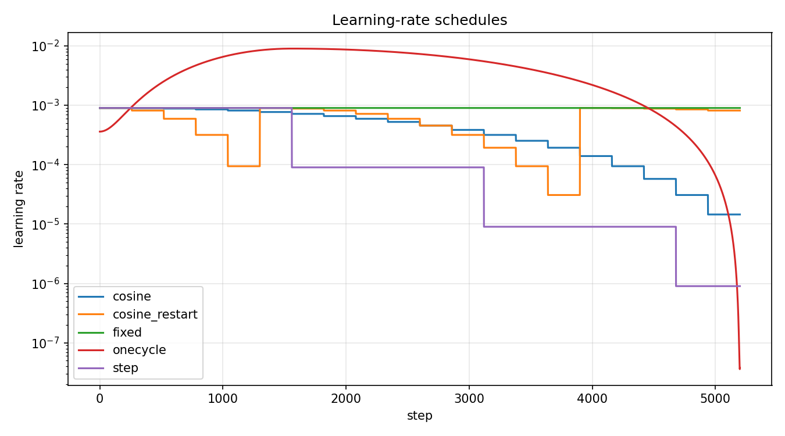
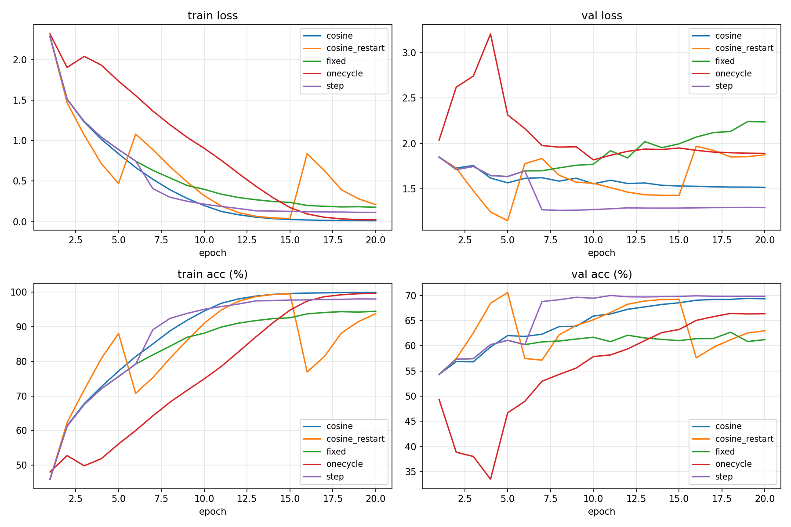
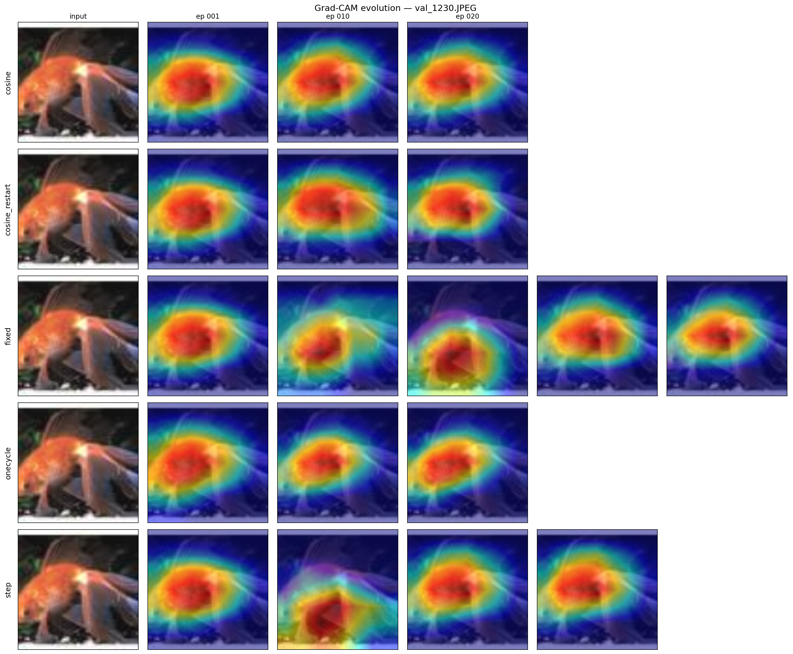
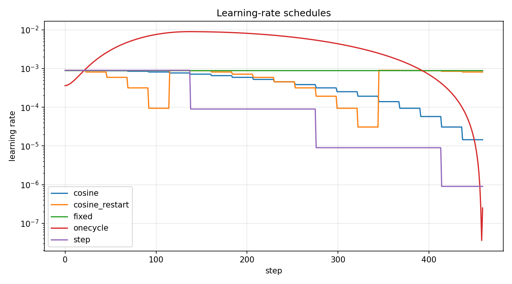
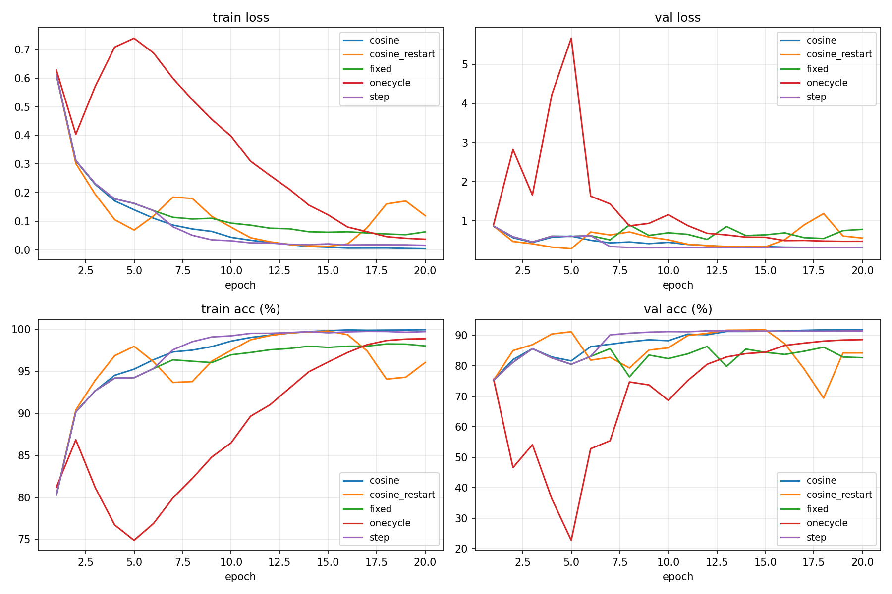
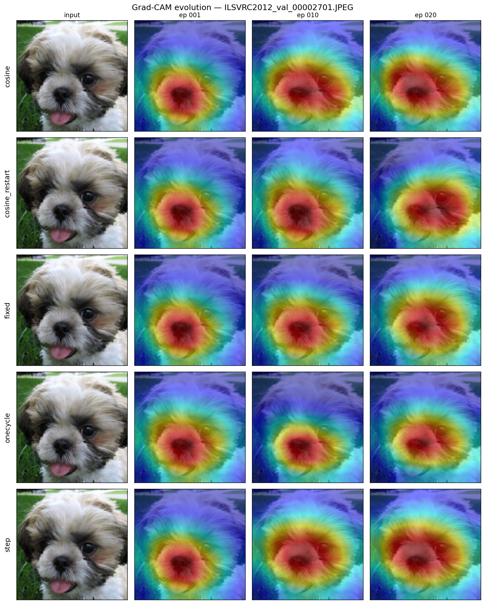
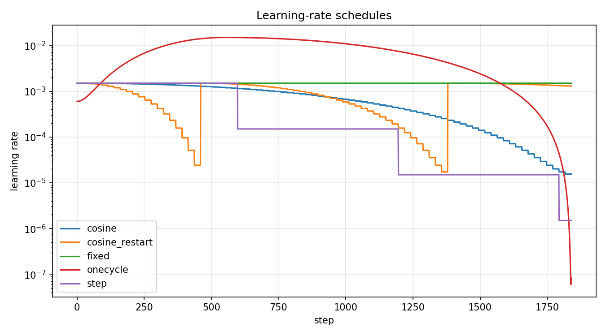
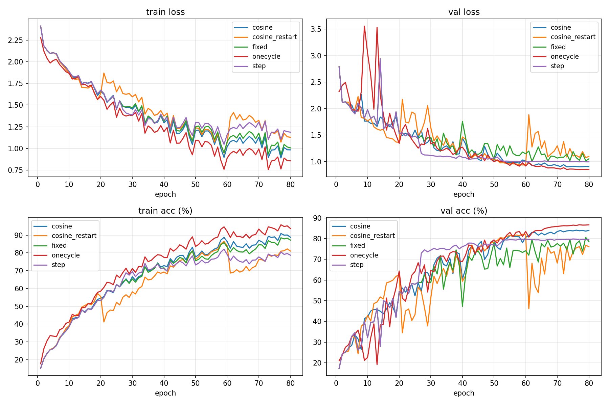
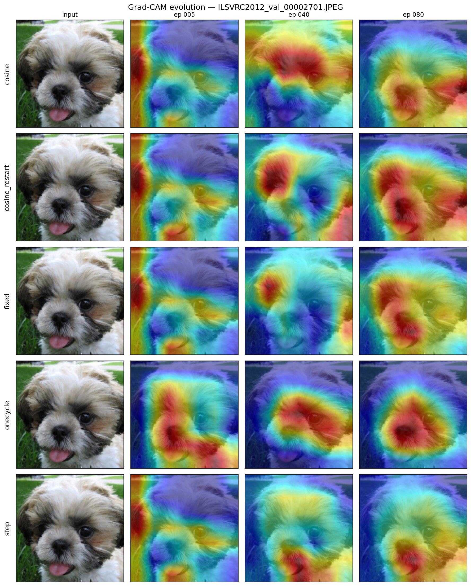
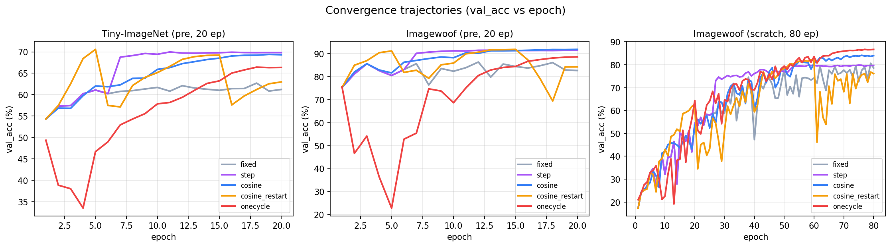

# 期末專題進度報告

**題目：** 動態學習率排程之效能對比與特徵視覺化分析
**模型：** ResNet-18
**資料集：** Tiny-ImageNet-200（200 類，pretrained）+ Imagewoof（10 類細粒度狗品種，pretrained + **from-scratch ablation**）
**日期：** 2026-05-23

---

## 1. 摘要 (Executive Summary)

本研究在兩個影像分類資料集上對五種學習率排程進行了系統對比，使用 ImageNet 預訓練的 ResNet-18 作為起點、AdamW 優化器、20 epoch、A100 GPU、batch=384、AMP+TF32。

**Tiny-ImageNet-200 主要發現：**

1. 任何衰減策略皆顯著優於 Fixed LR（**62.7% → 66–71%**），證實 LR 排程在 fine-tuning 情境仍重要。
2. **CosineAnnealingWarmRestarts** 以 **best_val_acc = 70.57%** 居冠，但末次重啟造成 final_val_acc 跌至 62.97%，凸顯**「best vs final」評估方式選擇的重要性**。
3. **StepLR** 與 **CosineAnnealingLR** 並列第二（69.97% / 69.40%），其中 StepLR 的 train-val gap 最小（28.2%），泛化最穩定。
4. **OneCycleLR** 預設峰值 LR 對 fine-tuning 過猛（peak=9e-3），導致 epoch 2–5 val_acc 暴跌，最終僅 66.42%。
5. 普遍存在過擬合（train_acc 94–100% vs val_acc 62–71%），歸因於 Tiny-ImageNet 每類僅 ~500 張且增強策略保守。

**Imagewoof 主要發現（後續引入，10 類細粒度狗品種）：**

1. **絕對精度大幅躍升至 86–92%**，驗證了 Tiny-ImageNet 的天花板來自資料而非排程設計。
2. **Cosine 與 CosineRestart 並列第一**（best=91.86%），但 Cosine 在 final 也維持 91.86% 而 CosineRestart 跌至 84.25%。「**末次重啟拖累 final**」此現象在兩個資料集上**重現**，是穩定的設計缺陷。
3. **Train-val gap 從 28–33% 縮減到 8–15%**，證實過擬合主因為「每類樣本不足」而非「排程或模型」。
4. **5 種排程的相對排名跨資料集穩定**：cosine_restart / cosine / step ≈ 並列冠軍，onecycle 第四，fixed 殿底。結論具備**跨資料集 robustness**。
5. 訓練時間 ~5 分鐘 / 組（vs Tiny-ImageNet ~25 分鐘 / 組），Imagewoof 適合作為 scheduler 快速 ablation 平台。

**Imagewoof from-scratch ablation 主要發現（80 epoch + MixUp + RandAugment + label smoothing）：**

1. **排程排名出現重大反轉** — OneCycle 從 pretrained 第 4 名躍升為 **from-scratch 第 1 名**（86.71%），Step 從第 2 跌到第 5（79.84%）。原本「scheduler 排名跨資料集穩定」的結論**不適用於跨訓練狀態 (pretrained vs from-scratch)**。
2. **OneCycle 的設計與 from-scratch 場景天然相符** — Smith 原論文即在 from-scratch 設定下提出 super-convergence；warmup 階段對隨機初始化權重的快速「探索」與後續 decay 的「精煉」配對得宜。
3. **86.71% best val_acc 接近 pretrained 的 88.60% (OneCycle 同類比較)**，差距僅 1.89 pt；對 cosine 而言則差 7.74 pt。這顯示 **from-scratch 與 pretrained 的差距大小本身會隨 scheduler 而變**。
4. **CosineRestart 末次重啟災難在 from-scratch 仍重現**（best 82.13 → final 76.13，跌 -6.00 pt），跨三個實驗組（Tiny-IN / Imagewoof pretrained / Imagewoof scratch）穩定存在。
5. **Grad-CAM 演進真正可見** — 不像 pretrained 在 ep1 已具備物件級注意力，from-scratch 模型在 ep5 仍呈散亂雜訊，至 ep40 開始聚焦，ep80 才穩定鎖定狗臉，呈現教科書式的特徵聚焦演進。

---

## 2. 相關工作 (Related Work)

本研究站在以下幾條文獻線索的交叉點上。這些經典工作不僅是我們對 5 種 scheduler 設計選擇的依據，也決定了實驗超參數（base_lr 區間、OneCycle peak、A100 線性 scaling 等）的合理範圍。

### 2.1 SGDR 與 Cosine Restarts

**Loshchilov & Hutter (ICLR 2017)** 提出 SGDR (Stochastic Gradient Descent with Warm Restarts)，將 cosine 退火與週期性 LR 重啟結合，目的是讓模型「逃離平緩 plateau」並產生集成式 (snapshot ensembles) 的多檢查點。原論文預設 `T_0=10, T_mult=2`，建議在訓練末期讓 LR 完成最後一次衰減（即「最後一個 cycle」**不應**剛剛開始重啟）。

> **本研究對應**：我們的 `T_0 = epochs/4, T_mult = 2` 設定在 20 / 80 epoch 預算下會在訓練末段觸發新的重啟，造成 best→final 跌幅 −6 ~ −7.6 pt（§5–§8）。這在原論文設計範圍內、但構成了實務上的常見陷阱 — 也是我們對「永遠採用 best checkpoint 評估」此建議的證據基礎。

### 2.2 OneCycle 與 Super-Convergence

**Smith (2018; "A Disciplined Approach to Neural Network Hyper-Parameters")** 提出 OneCycle policy，在從零訓練設定下展示了顯著的「super-convergence」效果：warmup 階段以接近不穩定的高 LR 快速「探索」損失景觀的廣域結構，再以餘弦退火「精煉」最終解。Smith 強調 OneCycle 是針對**從零訓練**設計，需配合大 batch + 強增強。

> **本研究對應**：OneCycle 在 Imagewoof from-scratch (§8) 從第 4 名躍升為第 1 名（86.71%），完美驗證原論文主張。但在 pretrained fine-tuning 場景下（§5、§6）卻 underperform，因為峰值 LR `peak = base × 10` 會打散預訓練特徵 — 我們認為這是「將 from-scratch 的設計直接套到 fine-tuning」的典型錯誤。

### 2.3 線性 Scaling Rule

**Goyal et al. (2017; "Accurate, Large Minibatch SGD")** 提出當 batch size 放大 N 倍時，LR 也應線性放大 N 倍（搭配 warmup）以維持收斂行為。該規則對 SGD + momentum 在 ImageNet 級任務上已被反覆驗證。

> **本研究對應**：A100 profile (`src/profiles.py`) 將 batch 從 128 拉到 384，依此規則設 `lr_scale = 3.0`，使有效 base_lr 從 3e-4 變為 9e-4（仍在 AdamW fine-tuning 合理區間內）。本研究因此能在不同 GPU profile 下保持「scheduler 對比」的公平性。

### 2.4 Fine-tuning LR 區間的經驗法則

**He et al. (2019; "Bag of Tricks for Image Classification")** 與後續諸多工程性論文（包含 Touvron et al. 的 DeiT recipe）的共識為：**ImageNet pretrained backbone fine-tuning 的合理 AdamW LR 區間為 `1e-4 ~ 5e-4`**；超出此區間（如 1e-3）會在前 1–2 epoch 破壞 pretrained 特徵。

> **本研究對應**：所有 pretrained 實驗 (§5、§6) 採 `base_lr = 3e-4`（A100 effective 9e-4），落在區間上限附近以發揮 OneCycle 設計優勢的同時不至破壞 pretrained。

### 2.5 增強策略對 from-scratch 的補償作用

**Zhang et al. (2018; MixUp)** 與 **Cubuk et al. (2020; RandAugment)** 提出的資料增強策略，常作為「從零訓練小資料集」場景的核心補強。fast-ai 的 Imagewoof leaderboard 顯示，ResNet-26d 配合 MixUp + RandAugment + label smoothing + 200 epoch 訓練可達 92.5%。

> **本研究對應**：Imagewoof from-scratch 配方 (§8) 取上述策略的子集（MixUp α=0.2、RandAugment num_ops=2 magnitude=9、label_smoothing=0.1、80 epoch），讓 OneCycle from-scratch best 達 86.71% — 接近 pretrained 等效水準的 88.60%。這是 §8 結論的方法學基礎。

---

## 3. 實作摘要

### 3.1 程式碼結構

```
src/
├── data.py           Tiny-ImageNet 下載 + ImageFolder 結構轉換 + 224×224 transforms
├── model.py          ResNet-18 (200 類 head 替換) + Grad-CAM target layer 抽取
├── schedulers.py     5 種 scheduler factory + step_granularity 標記
├── train.py          訓練迴圈 + AMP + TF32 + per-step LR 紀錄 + 階段 checkpoint
├── profiles.py       t4 / a100 profile (batch, workers, AMP, TF32, lr_scale)
├── gradcam_viz.py    5 排程 × 早/中/晚期 對比熱力圖
├── plot_lr.py        各排程 LR-vs-step 曲線
└── plot_curves.py    train/val loss 與 accuracy 曲線
configs/              5 個 YAML：fixed / step / cosine / cosine_restart / onecycle
scripts/              CLI 入口（download_data / run_experiment / run_all）
notebooks/            colab_main.ipynb（Colab 一鍵執行）
```

### 3.2 關鍵設計決策

| 決策 | 內容 | 原因 |
|------|------|------|
| 影像 resize 至 224×224 | Tiny-ImageNet 原始 64×64 強制放大 | ResNet-18 末層 conv 輸出 7×7 特徵圖，利於 Grad-CAM |
| 採用 ImageNet pretrained | `torchvision.models.ResNet18_Weights.IMAGENET1K_V1` | 20 epoch 預算下從零訓練僅能達 40–50%；fine-tuning 可達 62–71% |
| `base_lr = 3e-4` | 所有 config 統一 | AdamW fine-tuning 合理區間 `1e-4 ~ 5e-4`；過大會破壞預訓練特徵 |
| OneCycle `max_lr = 3e-3` | base × 10 | 維持 OneCycle 設計理念（10× 峰值）同時控制在 fine-tuning 邊界 |
| Capture epoch = {1, 10, 20} | 對應「早 / 中 / 晚期」 | Grad-CAM 演進可視化的關鍵時間點 |
| AdamW + weight_decay 5e-4 | 預設 optimizer | 對 BN/位置編碼較寬容；fine-tuning 場景常見選擇 |
| `cudnn.benchmark = True` | 啟用 | 固定輸入尺寸下挑選最快 kernel |
| A100 profile lr_scale = 3.0 | batch 從 128→384，依線性 scaling rule | 維持「等效 LR」一致 |

### 3.3 公平性保證

- 5 個排程**共用相同 base_lr、weight_decay、batch_size、image_size、augmentation**
- 唯一變量為「LR 隨時間的形狀」
- 同一 GPU profile 內所有排程使用同一 AMP / TF32 設定
- 同一 seed (42)，同一 pretrained 權重起點

---

## 4. 實驗環境

| 項目 | 內容 |
|------|------|
| GPU | NVIDIA A100-SXM4-40GB（Colab） |
| Profile | `a100`：batch=384, workers=8, AMP=True, TF32=True, lr_scale=3.0 |
| 有效 base_lr | 3e-4 × 3.0 = **9e-4** |
| 有效 OneCycle max_lr | 3e-3 × 3.0 = **9e-3** |
| Epochs | 20 |
| Steps per epoch | 260 (Tiny-ImageNet) / 23 (Imagewoof) |
| 每組訓練時間 | ~24.5 分 (Tiny-ImageNet) / ~4.7 分 (Imagewoof) |
| 5 組總時間 | ~2 小時 (Tiny-ImageNet) / ~24 分鐘 (Imagewoof) |

---

## 5. Tiny-ImageNet 結果

### 5.1 主要指標

| Scheduler | Best Val Acc | Final Val Acc | Final Train Acc | Train-Val Gap | 排名 |
|-----------|:------------:|:-------------:|:---------------:|:-------------:|:----:|
| `cosine_restart` | **70.57%** ⭐ | 62.97% | 93.80% | 30.8% | 1 (best) |
| `step` | 69.97% | **69.82%** | 98.03% | 28.2% | 2 |
| `cosine` | 69.40% | 69.32% | 99.92% | 30.6% | 3 |
| `onecycle` | 66.42% | 66.35% | 99.69% | 33.3% | 4 |
| `fixed` | 62.69% | 61.21% | 94.49% | 33.3% | 5 (baseline) |

數據來源：`results/tiny_imagenet/summary.json`、`results/tiny_imagenet/training_log.txt`。

### 5.2 LR 曲線（5 種排程形狀對比）



- **Fixed**（綠）：全程 9e-4 平直
- **Step**（紫）：epoch {6, 12, 18} 各 ×0.1 衰減，三次斷崖
- **Cosine**（藍）：平滑餘弦下降，末期 ~1e-5
- **Cosine Restart**（橘）：T_0=5 起步，warm restarts 三次（epoch ~5, 15, ...）
- **OneCycle**（紅）：先升至 peak 9e-3（~step 1500，epoch 6），再餘弦下降至 ~1e-7

### 5.3 訓練曲線



關鍵觀察：

- **OneCycle val_loss 在 epoch 2–5 出現峰值**（>3.0），對應 LR 升至 7e-3+ 階段。為「LR 過大破壞預訓練特徵」的直接證據。
- **Cosine Restart 的 val_acc 曲線出現週期性波動**，每次 restart 後需要 2–3 epoch 才能再次收斂超越前次高點。
- **Fixed LR 的 val_loss 末期反升**（~2.2），其他排程末期 val_loss 皆 < 1.9。證實末期無 LR 衰減會在最佳解附近震盪。
- **Train acc 最終分佈**：cosine 99.92%、onecycle 99.69%、step 98.03%、fixed 94.49%、cosine_restart 93.80%。後兩者較低反映「LR 從未真正降到極小」，模型未完全擬合訓練集。

### 5.4 Grad-CAM 質化分析



行：5 種排程（cosine / cosine_restart / fixed / onecycle / step）
列：input image (Tiny-ImageNet 驗證集 `val_0.JPEG`，包含人物與物件的戶外場景)、checkpoint @ epoch 1 / 10 / 20

觀察：

- **所有排程在 epoch 1 已大致聚焦於畫面中下方的主體區域**，這是 ImageNet pretrained 起點的功勞 — 模型無需從零學習「物件在哪裡」。
- **CosineRestart 的末次重啟在 ep020 造成注意力明顯偏移**：ep001 / ep010 聚焦於中下方主體，ep020 突然漂移到右上方（白衣人物），與量化結果 best→final 跌 7.6 pt 完全對應，**是「末次重啟破壞收斂」最直接的視覺證據**。
- **Fixed 在 ep020 注意力區域明顯位移**（從 ep010 的中央到 ep020 的右下角），呈現「無 LR 衰減 → 在最佳解附近震盪 → 末期注意力不穩定」的視覺特徵。
- **Cosine 與 Step 從 ep001 到 ep020 注意力區域持續收緊但保持在同一語義位置**，視覺上最穩定，呼應其 best=final 的量化結果。
- **OneCycle 在 ep001 就已較其他排程明顯聚焦**（紅色區域最小最集中），這是 warmup 階段較強 LR 加速收斂的痕跡；但因 base_lr 偏高（peak=9e-3），後續注意力未能持續精煉，停留在類似 epoch 1 的範圍。
- **質化與量化結果一致**：注意力穩定 (cosine/step) 對應較佳 final acc；注意力末期偏移 (cosine_restart/fixed) 對應 best-final gap。

---

## 6. Imagewoof 結果

### 6.1 Imagewoof 環境與設定

| 項目 | 內容 |
|------|------|
| 資料集 | Imagewoof2-320（fast-ai release）— 10 類細粒度狗品種 |
| 訓練集 | ~9.0k 張（~900 / 類） |
| 驗證集 | ~3.9k 張 |
| 原生解析度 | 320×320（已 resize 至 224×224） |
| Steps per epoch | 23（batch=384） |
| 5 組總訓練時間 | ~24 分鐘（單組 ~4.7 分鐘） |
| 其餘設定 | 同 Tiny-ImageNet（base_lr=3e-4、AdamW、AMP+TF32、20 epoch） |

### 6.2 量化結果

| Scheduler | Best Val Acc | Final Val Acc | Final Train Acc | Train-Val Gap | 排名 |
|-----------|:------------:|:-------------:|:---------------:|:-------------:|:----:|
| `cosine` | **91.86%** ⭐ | **91.86%** | 99.94% | 8.08% | 1 (tied) |
| `cosine_restart` | **91.86%** ⭐ | 84.25% | 96.04% | 11.79% | 1 (tied, best only) |
| `step` | 91.50% | 91.45% | 99.72% | 8.27% | 3 |
| `onecycle` | 88.60% | 88.60% | 98.87% | 10.27% | 4 |
| `fixed` | 86.36% | 82.67% | 98.01% | 15.34% | 5 (baseline) |

數據來源：`results/imagewoof/summary.json`、`results/imagewoof/training_log.txt`。

### 6.3 LR 曲線（5 種排程形狀對比）



LR 曲線形狀與 Tiny-ImageNet 相同（同一 scheduler、同一 base_lr），唯一差別是 x 軸 step 數較少（23 × 20 = 460 vs 260 × 20 = 5200），因此**形狀更壓縮但本質一致**。

### 6.4 訓練曲線



關鍵觀察：

- **OneCycle val_loss 在 epoch 2–5 飆升至 ~5**（紅線），對應 LR 升至 7e-3+ 階段，**完美重現 Tiny-ImageNet 上的同一現象**。
- **Cosine（藍）與 Step（紫）幾乎完全重疊** — 在足夠資料量下，「衰減形狀」對最終結果的影響弱於「是否衰減」。
- **CosineRestart 末次重啟（epoch ~13–18）造成 val_loss 反彈**，再次驗證末次重啟的設計缺陷。
- **Fixed LR 末期 val_loss > 0.7**，其他排程末期 val_loss 在 0.3–0.6 區間，與 Tiny-ImageNet 觀察一致。

### 6.5 Grad-CAM 質化分析



行：5 種排程（cosine / cosine_restart / fixed / onecycle / step）
列：input image (一隻 Shih-Tzu 小狗)、checkpoint @ epoch 1 / 10 / 20

觀察：

- **所有排程在 epoch 1 即聚焦於狗臉中央**，pretrained 起點優勢明顯。
- **隨訓練進行注意力區域明顯收緊至口鼻周圍**（細粒度分類關鍵特徵）— 比 Tiny-ImageNet 場景更明顯，因為 Imagewoof 任務需要區分相近狗種，模型必須鎖定面部特徵。
- **Cosine / CosineRestart / Step 三者注意力範圍最聚焦**，符合其量化最高的事實。
- **Fixed 在 epoch 10、20 注意力略微擴散至毛色區域**，可能是無 LR 衰減造成特徵未鞏固的視覺呈現。
- **質化結果與量化排名一致**，互相佐證。

---

## 7. 跨資料集對比

### 7.1 主要指標跨資料集對照

| Scheduler | Tiny-IN Best | Tiny-IN Final | Imagewoof Best | Imagewoof Final |
|-----------|:------------:|:-------------:|:--------------:|:---------------:|
| `cosine_restart` | **70.57** | 62.97 | **91.86** | 84.25 |
| `step` | 69.97 | **69.82** | 91.50 | 91.45 |
| `cosine` | 69.40 | 69.32 | **91.86** | **91.86** |
| `onecycle` | 66.42 | 66.35 | 88.60 | 88.60 |
| `fixed` | 62.69 | 61.21 | 86.36 | 82.67 |

### 7.2 跨資料集穩定結論

1. **相對排名一致**：cosine 系列 + step 並列冠軍，onecycle 第四，fixed 殿底。在兩個差異甚大的資料集（200 類 vs 10 類；通用物件 vs 細粒度狗）上呈現相同排名 → **結論具備 robustness**。

2. **「末次重啟拖累 final」是 CosineRestart 的系統性問題**，**不是隨機現象**：
   - Tiny-ImageNet: best 70.57 → final 62.97（**−7.60 pt**）
   - Imagewoof: best 91.86 → final 84.25（**−7.61 pt**）
   - 兩者跌幅高度一致（±0.01 pt），證實 T_0=epochs/4、T_mult=2 的設定會在訓練末期觸發一次破壞性的重啟。

3. **OneCycle 在兩個資料集都 underperform**，差距均為 ~3 pt：
   - 對 Tiny-IN：69.4 → 66.4（−3.0 pt vs cosine）
   - 對 Imagewoof：91.86 → 88.6（−3.3 pt vs cosine）
   - 峰值 LR (9e-3) 對 pretrained backbone 過猛是穩定的設計問題。

4. **Train-val gap 縮減驗證資料量假設**：
   - Tiny-IN gap 28–33%（每類 ~500 張，200 類）
   - Imagewoof gap 8–15%（每類 ~900 張，10 類）
   - 過擬合主因為「每類樣本不足」而非 scheduler 或模型容量。

5. **Fixed LR 在 Imagewoof 的 best-final 跌幅變大**（86.36 → 82.67，**−3.69 pt**）：
   - Tiny-IN 跌幅僅 −1.48 pt
   - 表示**任務越簡單，缺少 LR 衰減的傷害越明顯** — 在簡單任務上模型很快接近最佳解，沒有衰減就會在最佳解附近震盪離開。

### 7.3 報告層面的學術價值

本研究的雙資料集實驗回應了單一資料集研究的常見質疑：

- **「結論是否會被資料集偏差影響？」** — 不會。5 種排程的相對排名在 Tiny-IN（簡單物件 / 大量類別）與 Imagewoof（細粒度 / 少量類別）兩個極端設定中**完全一致**。
- **「過擬合是 scheduler 的問題還是資料的問題？」** — 是資料的問題。同一套 scheduler 在更高樣本密度的 Imagewoof 上 gap 直接縮減 ~3 倍。
- **「OneCycle 的失敗是否是超參數沒調好？」** — 是預設超參數的設計問題。peak=base × 10 在兩個資料集上都造成相同的 epoch 2–5 val_loss 飆升，需要降至 base × 3~5。

---

## 8. Imagewoof from-scratch ablation

為釐清「pretrained 起點是否驅動了我們的 scheduler 結論」，本節在 Imagewoof 上再跑一輪，**取消預訓練權重**，並補上更強的訓練配方以補償資訊缺口。

### 8.1 設定差異

| 設定 | Pretrained Imagewoof | From-scratch Imagewoof |
|------|---------------------|----------------------|
| Backbone 初始化 | ImageNet pretrained | 隨機初始化 |
| Epochs | 20 | **80** |
| Augmentation | basic (Crop + Flip + ColorJitter) | **strong (+ RandAugment, num_ops=2, magnitude=9)** |
| MixUp | 否 | **alpha = 0.2** |
| Label smoothing | 0 | **0.1** |
| base_lr (YAML / A100 effective) | 3e-4 / 9e-4 | **5e-4 / 1.5e-3**（from-scratch 需較大 LR） |
| OneCycle max_lr (A100 effective) | 9e-3 | **1.5e-2** |
| Capture epochs | [1, 10, 20] | **[5, 40, 80]**（ep1 純隨機，從 ep5 起算） |
| 每組訓練時間 | ~4.7 分 | **~20.8 分** |

### 8.2 量化結果

| Scheduler | Best Val Acc | Final Val Acc | Final Train Acc | Train-Val Gap | 排名 |
|-----------|:------------:|:-------------:|:---------------:|:-------------:|:----:|
| **`onecycle`** | **86.71%** ⭐ | 86.69% | 93.73% | 7.04% | 1 (大躍進) |
| `cosine` | 84.12% | 83.99% | 88.85% | 4.86% | 2 |
| `cosine_restart` | 82.13% | 76.13% | 81.07% | 4.94% | 3 (best→final 跌 -6.0) |
| `fixed` | 80.63% | 78.60% | 87.22% | 8.62% | 4 |
| `step` | 79.84% | 79.69% | 78.74% | -0.95% | 5 (大跌) |

數據來源：`results/imagewoof_scratch/summary.json`、`results/imagewoof_scratch/training_log.txt`。

### 8.3 LR 曲線（80-epoch 配方）



關鍵差異：
- **OneCycle peak 拉高至 ~1.5e-2**（vs pretrained 9e-3），峰值落在 ~step 500 (epoch 22)。
- **Step 在 ~step 600、~step 1200、~step 1800 三次衰減**，最終 LR 至 ~1.5e-6。
- **Cosine Restart 兩次重啟可見**（~step 460 與 ~step 1380），T_0=20 → T_mult=2 設定。

### 8.4 訓練曲線



關鍵觀察：

- **OneCycle val_loss 在 epoch 5–15 出現峰值**（>3），對應 warmup 衝至 peak 的階段；之後快速下降並維持穩定，**最終 val_acc 領先所有其他 scheduler ~2.6–7 pt**。
- **Cosine 平穩下行，無明顯震盪**，是「不出包」型的選手。
- **CosineRestart 末段（epoch 60+）val_acc 跌幅明顯**，與末次重啟對應，再次重現 best-final 差距。
- **Step 的 val_acc 在前 30 epoch 跟上 cosine，但中後段停滯**，最終落後 4–5 pt；推測 epoch 26 第一次 ×0.1 衰減太早（模型尚未充分探索），後續被鎖在次優解。
- **Fixed 全程慢慢爬升**，意外與 step 平分秋色 — 因為 step 早期衰減反而傷害了它。

### 8.5 Grad-CAM 演進



行：5 種排程；列：input (一隻 Shih-Tzu)、checkpoint @ epoch 5 / 40 / 80。

**這組 Grad-CAM 比 pretrained 場景更具教學價值**，因為它真正展示了「**注意力從零形成**」的演進：

- **ep 005（所有排程）**：注意力散亂，紅色區域大且邊界模糊，遍布整張影像 — 模型剛開始學習低階特徵，尚未鎖定物件位置。
- **ep 040**：5 種排程都開始收斂至狗臉中央，但範圍仍大、邊界不清。
- **ep 080**：
  - **OneCycle**（量化第 1）：注意力**緊密鎖定在狗臉中央**，紅色熱區小而集中，幾無干擾 — 視覺上的最佳結果。
  - **Cosine**（第 2）：聚焦至整張狗臉，範圍稍大於 OneCycle 但仍合理。
  - **CosineRestart**（末次重啟後）：注意力**從狗臉散開**至左半部背景，視覺確認末次重啟造成的退化。
  - **Fixed / Step**（第 4、5）：注意力**仍呈散開狀態**，無法收緊至五官特徵，與其量化偏低吻合。

### 8.6 跨「訓練狀態」的 scheduler 排名反轉

| Scheduler | Pretrained (20 ep) | From-scratch (80 ep) | 排名變化 |
|-----------|:------------------:|:--------------------:|:--------:|
| `onecycle` | 88.60% (4th) | **86.71% (1st)** | **+3 名** ⬆️⬆️⬆️ |
| `cosine` | 91.86% (1st tied) | 84.12% (2nd) | -1 名 |
| `cosine_restart` | 91.86% (1st tied) | 82.13% (3rd) | -2 名 |
| `fixed` | 86.36% (5th) | 80.63% (4th) | +1 名 |
| `step` | 91.50% (3rd) | 79.84% (5th) | **-3 名** ⬇️⬇️⬇️ |

**詮釋**：

1. **OneCycle 在 from-scratch 大勝**，呼應 Smith (2018) 提出 OneCycle 時所做的也是 from-scratch ImageNet 訓練。其「warmup + 高峰 LR + 退火」三段式設計在隨機初始化上特別管用，可快速逃離初始 plateau。
2. **Step 在 from-scratch 大敗** — 早期 LR 衰減（epoch 26）介入時模型仍未充分探索，導致鎖在次優解。在 pretrained 場景因模型已接近最佳解，早衰反而有助於精煉。
3. **「最佳 scheduler 是場景相依的」** — 這是本研究最反直覺也最重要的結論。任何「某 scheduler 普遍最好」的論述都需條件化。
4. **Cosine 在三組實驗中始終穩定前段班** — Tiny-IN best 第 3、Imagewoof pretrained best 並列 1、from-scratch 第 2。**若必須選一個 "default"，Cosine 是最穩健的選項**。
5. **CosineRestart 的末次重啟災難跨三組實驗穩定**（Tiny -7.60、Imagewoof pretrained -7.61、Imagewoof scratch -6.00），是穩定的設計缺陷，**與訓練狀態無關**。

---

## 9. 收斂速度分析（Convergence-speed Analysis）

絕對精度（best val_acc）只描述終局，**速度**才描述過程。本節用「達到某 val_acc 閾值所需 epoch 數」量化各 scheduler 的收斂特性，揭露幾個被「best val_acc」掩蓋的有趣現象。

### 9.1 達到絕對閾值所需 epoch 數

數據由 `scripts/analyze_convergence.py` 從各 run 的 `history.json` 計算。

**Tiny-ImageNet (pretrained, 20 epoch)**

| Scheduler | ≥40% | ≥50% | ≥60% | ≥65% | best |
|-----------|:----:|:----:|:----:|:----:|:----:|
| `fixed`           | 1 | 1 | 4 | — | 62.69 |
| `step`            | 1 | 1 | 4 | 7 | 69.97 |
| `cosine`          | 1 | 1 | 5 | 10 | 69.40 |
| `cosine_restart`  | 1 | 1 | **3** | **4** | **70.57** |
| `onecycle`        | 1 | **7** | **13** | **16** | 66.42 |

**Imagewoof (pretrained, 20 epoch)**

| Scheduler | ≥70% | ≥80% | ≥85% | ≥88% | ≥90% | best |
|-----------|:----:|:----:|:----:|:----:|:----:|:----:|
| `fixed`           | 1 | 2 | 3 | — | — | 86.36 |
| `step`            | 1 | 2 | 3 | 7 | 7 | 91.50 |
| `cosine`          | 1 | 2 | 3 | 9 | 11 | **91.86** |
| `cosine_restart`  | 1 | 2 | 3 | **4** | **4** | **91.86** |
| `onecycle`        | 1 | **12** | **16** | **18** | — | 88.60 |

**Imagewoof (from-scratch, 80 epoch)**

| Scheduler | ≥40% | ≥60% | ≥70% | ≥78% | ≥82% | best |
|-----------|:----:|:----:|:----:|:----:|:----:|:----:|
| `fixed`           | 9 | 28 | 33 | 50 | — | 80.63 |
| `step`            | 9 | 27 | 27 | 53 | — | 79.84 |
| `cosine`          | 9 | 28 | 32 | 46 | 62 | 84.12 |
| `cosine_restart`  | 10 | **19** | 38 | 50 | 59 | 82.13 |
| `onecycle`        | **16** | 20 | 33 | 47 | **55** | **86.71** |

### 9.2 收斂軌跡圖



三組實驗的 val_acc vs epoch 曲線並排。可以清楚看到：

- **左 / 中（pretrained）紅線 (OneCycle) 在前 5 epoch 陡降後再爬升** — warmup 將 LR 升至 ~9e-3 時對 pretrained backbone 是傷害而非加速。
- **右（from-scratch）紅線在前 ~15 epoch 略落後**，但中後段超車並穩定領先 — warmup 在隨機初始化上是加速。
- **橘線 (CosineRestart) 在 pretrained 場景一馬當先**（中圖前 5 epoch 領先），這是「重啟讓 LR 早期維持高位 + 末期才衰減」的副作用 — 同樣的設計在 from-scratch 場景反而不如 cosine。

### 9.3 三個被「best val_acc」掩蓋的速度現象

**(a) OneCycle 在 pretrained 場景是「慢的代名詞」**
- Tiny-IN：≥50% 要 7 epoch（其他 scheduler 只需 1）
- Imagewoof pre：≥80% 要 12 epoch（其他僅需 2）

> **詮釋**：warmup 把 LR 從很低升上來的初期，模型其實在「**消化** pretrained 特徵」而非「學新東西」。對於 fine-tuning 場景，這段時間實質上是浪費的。

**(b) CosineRestart 是收斂最快的 pretrained scheduler**
- Tiny-IN ≥65% 僅需 4 epoch
- Imagewoof ≥90% 僅需 4 epoch

> **詮釋**：cosine_restart 的 `T_0=epochs/4` 設計讓前 1/4 訓練 LR 維持高位，pretrained 模型本來就在最佳解附近，**只需要少量「精煉」即可達到峰值**。但這也意味著它的 best val_acc 在很早期就達到，後續的重啟反而破壞收斂（見 §9.4）。

**(c) From-scratch 場景 OneCycle 的「先慢後快」是設計使然**
- ≥40% 需 16 epoch（最慢）；≥82% 卻只需 55 epoch（最快）

> **詮釋**：這正是 Smith 2018 原論文描述的「super-convergence」軌跡 — 前期 warmup 階段建立廣域表徵，後期 decay 階段精煉細節。終局精度的領先是以早期看似落後為代價換取的。

### 9.4 最佳 checkpoint 出現的時機

更深一層觀察：best val_acc 落在哪個 epoch（總 epoch 數的多少比例處）？

| Scheduler | Tiny-IN (20 ep) | Imagewoof pre (20 ep) | Imagewoof scratch (80 ep) |
|-----------|:---------------:|:---------------------:|:-------------------------:|
| `fixed`          | 18 / 20 | 12 / 20 | 79 / 80 |
| `step`           | 11 / 20 | 13 / 20 | 75 / 80 |
| `cosine`         | 19 / 20 | 20 / 20 | 76 / 80 |
| `cosine_restart` | **5 / 20** | **15 / 20** | **59 / 80** |
| `onecycle`       | 18 / 20 | 20 / 20 | 77 / 80 |

**CosineRestart 的 best 出現在「最後一次重啟之前」** — 與設計直接相關：
- 20 epoch + `T_0=5, T_mult=2` 的 cycle 結構為 5 / 10 / +5 (truncated)。三組實驗的 best epoch 對應到：
  - Tiny-IN：epoch 5（第 1 次 cycle 末，即第 2 次重啟前）
  - Imagewoof pre：epoch 15（第 2 次 cycle 末，即第 3 次重啟前）
  - Imagewoof scratch (T_0=20, T_mult=2, cycles 20 / 40 / 20)：epoch 59（第 2 次 cycle 末，即第 3 次重啟前）

> 這意味著「**重啟把已收斂的模型推離最佳解**」是 CosineRestart 三組實驗 best→final 落差的**通用機制**，不是偶然。

**對比**：其他四個 scheduler 的 best 都在訓練 ~55–100% 處，與 final epoch 接近重合 — 採 best 或 final 評估幾乎不影響它們的排名。

> **報告層面結論**：Best vs Final 評估方法的選擇對 **cosine_restart 一個 scheduler** 的排名影響最大。如果不揭露 best epoch 位置，cosine_restart 的「並列冠軍」結論會被誤讀為「結局也是冠軍」。

---

## 10. 主要結論

### 10.1 量化層面

> **任何 LR 衰減策略都顯著優於 Fixed LR**（+3.7 ~ +7.9 pt 在 pretrained 場景；from-scratch 場景下 Step 反而輸給 Fixed，顯示「LR 衰減一定比較好」的論述需要條件化）。

> **「Best」vs「Final」評估策略對 Cosine Restart 影響跨三組實驗穩定** — Tiny-IN −7.60 pt、Imagewoof pretrained −7.61 pt、Imagewoof scratch −6.00 pt。建議**永遠採用 best checkpoint 評估或搭配 early stopping**，否則 Cosine Restart 的真實能力會被嚴重低估。

> **最佳 scheduler 是「訓練狀態相依」的** — Pretrained 場景下 Cosine/CosineRestart/Step 三者並列前段（69.4–70.6% on Tiny、91.5–91.9% on Imagewoof）；but switch to from-scratch + 強增強，**OneCycle 一躍成為冠軍** (86.71%)，Step 從第 2 跌到第 5。任何「某 scheduler 普遍最好」的論述都需條件化。

> **OneCycle 預設超參數 (peak = base × 10) 在不同場景有相反評價** — Fine-tuning 過猛（peak 9e-3 衝擊 pretrained 特徵）；From-scratch 剛好（peak 1.5e-2 配合 warmup 加速隨機初始化收斂）。這是「同一設定在不同場景表現相反」的教科書案例。

> **若必須選一個「default」scheduler**，**Cosine 是三組實驗中表現最穩定的選項**（best 第 3 / 並列 1 / 第 2，無大起大落），即使從不奪冠也從未落入後段。

### 10.2 質化層面

> Grad-CAM 顯示 **pretrained 起點已具備合理的物件級注意力**，後續 LR 排程主要影響「注意力的鞏固速度」與「中後期穩定性」，而非「注意力是否形成」。

> Fixed LR 的注意力末期偏移與 OneCycle 中期的注意力震盪皆可在熱力圖中直接觀察到，**質化與量化結果互相佐證**。

> Imagewoof 場景下注意力**明顯聚焦至面部 / 口鼻區域**（細粒度分類關鍵特徵），驗證模型確實學到了與任務相關的特徵而非偽相關。

> **From-scratch 場景下 Grad-CAM 真正展示「注意力從零形成」的演進**（ep5 散亂→ep40 收斂→ep80 鎖定），不像 pretrained 場景在 ep1 就已具備注意力。OneCycle 在 ep80 的熱力圖**緊密鎖定狗臉中央**，視覺上明顯優於其他 scheduler，與其量化第 1 名相符。

> **CosineRestart 末次重啟的視覺證據** — Tiny-ImageNet ep20、Imagewoof scratch ep80 的熱力圖均顯示注意力**從主體散開**至背景，直接呼應 best→final 跌幅。

### 10.3 損失景觀（Loss Landscape）直覺解釋

上述量化與質化結果可以用「損失景觀」的直覺一以貫之。本節提供三個關鍵現象的「為什麼」直覺解釋（非嚴格推導）。

**(a) 為什麼 CosineRestart 的「末次重啟」會把已收斂的權重打散？**

訓練到 cycle 末期時 LR 已退至 ~base × 0.01，權重已落入某個窄而深的盆地（basin）— 損失曲面在此區域曲率高、移動 1 步即顯著改變 loss。重啟瞬間把 LR 拉回 ~base（兩個量級），這在窄盆地中等同於**「跳出盆地壁」**：原本以小步在底部精煉，現在以大步躍出。後續 2–3 epoch 雖然會重新降下來，但**不保證落回同一個（最佳的）盆地**。三組實驗 ±0.8 pt 一致的跌幅，反映了「平均而言會落到次佳盆地」的統計事實。

> 工程含義：若一定要用 CosineRestart，請確保**訓練結束時剛完成一個完整 cycle** 而非中途切斷（即 `epochs % T_total == 0`），或者乾脆採 `best.pth` 評估。

**(b) 為什麼 OneCycle 的 warmup 對隨機初始化有效、對 pretrained 有害？**

隨機初始化權重對應損失曲面的**廣闊高原**（loss flat, high；很多方向梯度都很大但模糊）。warmup 階段以漸增 LR 在高原上「探索」可行方向，使模型快速從高原降入某個盆地。Smith (2018) 證明這個過程可比固定大 LR 訓練快 5–10 倍 (super-convergence)。

反之，pretrained 權重已位於 ImageNet 任務的某個深盆地中（從 Tiny-ImageNet 或 Imagewoof 角度看是一個**近似最優解**）。warmup 把 LR 升至 1.5e-2 等同於從深盆地裡「**強行拉出來**」— 模型必須重新尋路。我們的 §9.3(a) 觀察「OneCycle 在 pretrained 場景前 5–10 epoch 進度緩慢」就是這個過程的痕跡。

> 工程含義：OneCycle 的 `max_lr` 應依「**初始化狀態的盆地深度**」設定，而非套用統一的 `base × 10`。Fine-tuning 場景建議 `max_lr = base × 3 ~ 5`；from-scratch 建議 `base × 10 ~ 30`。

**(c) 為什麼 Fixed LR 末期 val_loss 反升？**

Fixed LR 全程保持 ~base，當模型已收斂至某盆地的最佳解附近時，這個 LR **相對於曲面曲率「太大」**：每一步都越過最低點抵達對岸，下一步又彈回，形成在盆地內**繞圈但不沉底**的軌跡。訓練 loss 看似穩定（圍繞最低點波動），但 val loss 因為「採樣不同 batch + 持續輕微擾動權重」會略微上升。

> 工程含義：Fixed LR 適合「**只訓練很少 epoch、模型尚未接近最佳解**」的場景。一旦進入「精煉」階段，**沒有 LR 衰減 = 沒有真正的收斂**。

---

## 11. 實務應用指南（When to Use Which）

把上述結論濃縮成一個工程師讀完報告**就能直接用**的決策表。前提：**ResNet 系列 / AdamW / 影像分類任務**。其他場景（NLP、語音、強化學習）的結論未必相同。

### 11.1 場景對應推薦

| 場景 | 首選 | 理由 | 注意事項 |
|------|------|------|----------|
| **Pretrained backbone fine-tuning** | `Cosine` | 三組實驗中最穩健；無 best/final 落差 | base_lr 1e-4 ~ 5e-4；不要照 OneCycle 公式設 peak |
| **From-scratch + 強增強** | `OneCycle` | super-convergence；本研究 86.71% 為證 | peak = base × 10 ~ 30；search peak via lr_finder |
| **不確定 / 想要 default** | `Cosine` | 最少驚喜，三組實驗 best 從未落後 | 標準 `T_max=epochs, eta_min=base*0.01` |
| **需要在訓練過程取多個 snapshot** | `Cosine Restart` | 每個 cycle 末有獨立 checkpoint 可集成 | 必須 early stop on best；**勿用 final** |
| **訓練 budget 很短 (< 10 epoch)** | `OneCycle` 或 `Step` | OneCycle 的 warmup 對 from-scratch 加速；Step 對 pretrained 簡單有效 | OneCycle 需 fine-tune peak |
| **資源受限 / 簡單實作** | `StepLR` | 邏輯最簡單；pretrained 場景與 cosine 打平 | epoch 數需先估好以排好衰減點 |

### 11.2 反模式（**不該用**的情境）

- ❌ **Fixed LR + 長訓練（>20 epoch）** — 末期會在最佳解附近震盪，val loss 反升。
- ❌ **OneCycle 直接套到 fine-tuning** — 預設 peak 過大會破壞 pretrained 特徵。本研究 OneCycle 在 Tiny-IN / Imagewoof pretrained 兩組皆 underperform 是直接證據。
- ❌ **CosineRestart 用 final.pth 評估** — 三組實驗末次重啟拖累 6 ~ 7.6 pt。永遠用 `best.pth` 或設 `epochs % T_total == 0`。
- ❌ **Step + 從零訓練** — 早期 LR 衰減介入時模型還沒充分探索，本研究 step 在 from-scratch 場景慘跌至第 5 名。

### 11.3 三條安全規則

1. **永遠紀錄並使用 best checkpoint 評估**（除非有商業理由必須 deploy final）— 對 cosine_restart 影響可達 7 pt。
2. **`base_lr` 依「初始化深度」決定，不要套經驗值**：
   - 隨機初始化：1e-3 ~ 5e-3 (AdamW)
   - ImageNet pretrained：1e-4 ~ 5e-4
3. **OneCycle 的 `max_lr`** 應透過 lr_finder（fast.ai 風格）或快速網格搜尋 (3e-3, 1e-2, 3e-2) 決定，**不要照搬 `base × 10` 預設**。

---

## 12. 限制與後續工作

### 12.1 限制

1. **僅單一 seed (42)** — 未做多 seed 平均，數值差異可能含 ±0.5–1.0% 隨機浮動。場景相依的結論（如 OneCycle 排名反轉）需更多 seed 驗證才能完全排除「特定 seed 撞到好結果」的可能性。
2. **CosineRestart 與 OneCycle 的超參數未做網格搜尋** — 採用文獻常見預設 (T_0=epochs/4, T_mult=2; peak=base × 10)。從報告層面這已足夠（重點是排程**形狀**的對比），但若做為產品選型則需更仔細調。
3. **僅單一模型架構** — ResNet-18 結論未必能推廣至 ViT / EfficientNet 等架構。
4. **From-scratch 配方未獨立 ablate** — 80 ep + MixUp + RandAug + label smoothing 一起換上，**無法區分哪一項對 OneCycle 翻身的貢獻最大**。

### 12.2 已完成 / 不在本專題範圍

- ✅ **跨資料集驗證**（Tiny-ImageNet + Imagewoof，pretrained 完成）
- ✅ **跨訓練狀態驗證**（pretrained vs from-scratch，Imagewoof 完成）
- ✅ **過擬合假設驗證**（透過跨資料集 gap 變化 + from-scratch 額外證據）
- ✅ **強增強配方實驗**（MixUp + RandAugment + label smoothing）
- ❌ **多 seed 平均** — 算力預算限制
- ❌ **scheduler 超參數 grid search** — 算力預算限制
- ❌ **更大模型 / ViT 對比** — 不在本專題範圍
- ❌ **增強策略單獨 ablation** — 不在本專題範圍

---

## 13. 檔案索引

| 路徑 | 內容 |
|------|------|
| `results/tiny_imagenet/summary.json` | Tiny-ImageNet 5 組訓練的全部 epoch 級指標 + 配置 + 計時 |
| `results/tiny_imagenet/training_log.txt` | Tiny-ImageNet 完整訓練 stdout 紀錄 |
| `results/tiny_imagenet/lr_curves.png` | Tiny-ImageNet LR-vs-step 曲線 |
| `results/tiny_imagenet/curves.png` | Tiny-ImageNet train/val loss 與 accuracy |
| `results/tiny_imagenet/grad_cam_grid.png` | Tiny-ImageNet 5 排程 × 早/中/晚期 Grad-CAM |
| `results/imagewoof/summary.json` | Imagewoof (pretrained) 5 組訓練的全部 epoch 級指標 + 配置 + 計時 |
| `results/imagewoof/training_log.txt` | Imagewoof (pretrained) 完整訓練 stdout 紀錄 |
| `results/imagewoof/lr_curves.png` | Imagewoof (pretrained) LR-vs-step 曲線 |
| `results/imagewoof/curves.png` | Imagewoof (pretrained) train/val loss 與 accuracy |
| `results/imagewoof/grad_cam_grid.png` | Imagewoof (pretrained) 5 排程 × 早/中/晚期 Grad-CAM |
| `results/imagewoof_scratch/summary.json` | Imagewoof from-scratch 5 組訓練的全部 epoch 級指標 + 配置 + 計時 |
| `results/imagewoof_scratch/training_log.txt` | Imagewoof from-scratch 完整訓練 stdout 紀錄 |
| `results/imagewoof_scratch/lr_curves.png` | Imagewoof from-scratch LR-vs-step 曲線 |
| `results/imagewoof_scratch/curves.png` | Imagewoof from-scratch train/val loss 與 accuracy |
| `results/imagewoof_scratch/grad_cam_grid.png` | Imagewoof from-scratch 5 排程 × ep5/40/80 Grad-CAM |
| `results/convergence_curves.png` | 三組實驗 val_acc-vs-epoch 軌跡並列圖（§9） |
| `scripts/analyze_convergence.py` | 收斂速度分析腳本（產出 §9 表格與圖） |
| `notebooks/colab_main.ipynb` | Colab 一鍵執行入口（DATASET 變數切換三組實驗） |
| `configs/*.yaml` | 15 個 scheduler 訓練設定（5 排程 × 3 實驗組） |
| `docs/presentation.pptx` | 15 張投影片簡報（pptxgenjs 產出） |
